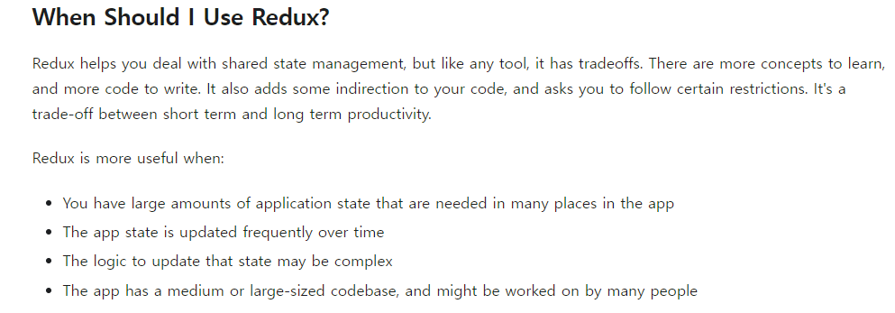
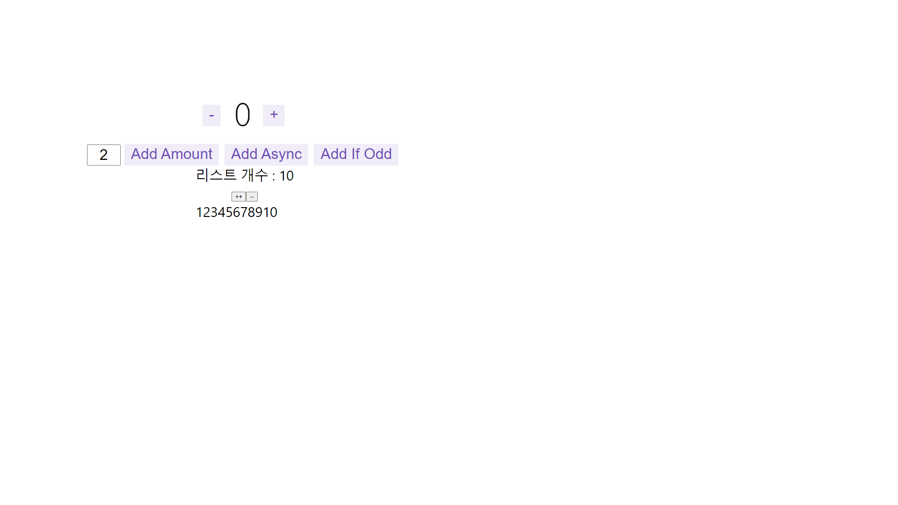

### Redux?

- 자바스크립트 앱을 위한 상태 관리 라이브러리
- React나 다른 뷰 라이브러리와 함께 쓸 수 있고, Redux 자체는 용량이 2kb 정도 밖에 안되지만, 다른 추가적인 애드온 들과 함께 사용할 수 있다.
- 아래와 같은 상황에 유용한다고 한다.

  - 많은 양의 상태관리가 필요 할 때
  - 여러 명의 개발자가 협업 할 때
  - 복잡한 로직의 상태들이 업데이트 되는 경우가 있을 때
  - 빈번한게 상태가 변경되는 상황이 있을 때

### 용어들 
- Immutability: 불변성
  - mutable 이라 함은 changeable을 말한다고 한다. 만약 어떤 것이 immutable 하다 함은 변하지 않는 다는 뜻
  - 자바스크립트 객체는 모두 mutable 하다.(객체나 배열 내부의 값을 변경해도 메모리를 여전히 같은 곳을 참조 하고 있기 때문)
  - 그래서 값을 immutable 하게 만들기 위해서 값이 변경되면 기존 값을 복사해서 그 복사한 값을 가지고 연산을 한다.
  - 이렇게 하면 불변성을 지킬 수 있다.
  - Redux expects that all state updates are done immutably
- Actions
  - An action is a plain JavaScript object that has a type field. You can think of an action as an event that describes something that happened in the application.
  - type 이라는 필드를 가지는 자바스크립트 객체. 어떠한 이벤트가 생길지 묘사해둔 것
- Reducer
  - 실제 상태를 변경하는 로직을 가지고 있는 함수
  - switch나 if 같은 것들을 통해서 action을 받아서 그에 맞게 분기쳐서 처리함
  - 여기서 실습 할 때는 redux-toolkit으로 했는데 reducer가 객체 형태로 들어 갔었음
- Store
  - 상태 값을 저장해두는 공간. 이라고 하는데 실제 해보니 상태를 변화 시키는 리듀서들이 들어가 있었음
- 그 외에도 여러 가지 용어들이 있는데 우선 toolkit 으로 실습해서 나오는 것만 적어봤음. 

### 결과물
- 일단 Typescript는 사용하지 않았고 CRA로만 만들어 봤다
- npx create-react-app my-app --template redux
- 기본 Counter 예제가 있었는데 실제로 서비스 하면서 배열을 다루는 일들이 많아 배열 추가 삭제 하는 것으로 해봄
  

### 최초 느낀 점
- 확실히 mobx와 다르게 코드를 작성하는 방법들이 고정되어 있음. 이 틀 안에서 새로운 구조 짜는 것은 한번 생각해봐야 할 듯?
그리고 사람들이 왜 대규모 인원들이 투입된 프로젝트에서 쓰라고 하는 지도 이해가 갔음. 또한 toolkit 이라는 
redux 에서 배포한 코드 작성 방법이 있어서 편하게 개발 할 수 있을 듯.

## Source

- Redux 공식 문서

  [<https://ko.redux.js.org/introduction/getting-started>](<https://ko.redux.js.org/introduction/getting-started>)