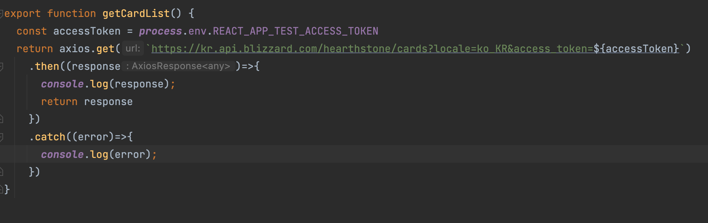
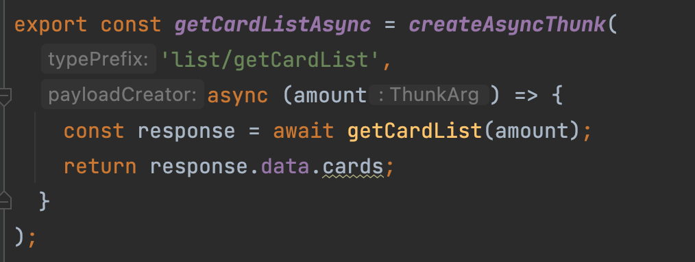
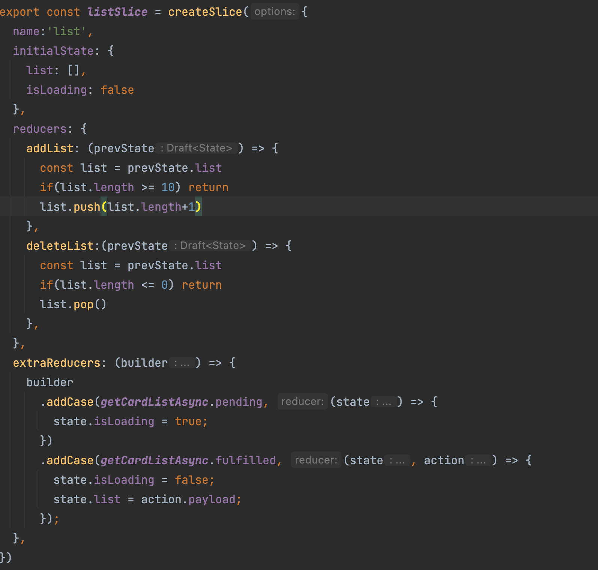

# 동기와 비동기가 무엇일까?
- 위키 백과에 나온 것을 인용하자면, 비동기 입출력이란 '데이터 전송을 마치기 전에 기타 프로세스가 계속하도록 허가하는 입출력 처리'의 형태라고 한다.
- A 코드 블럭과 B 코드 블럭이 순차적으로 있다고 하자. A 코드 블럭이 실행이 끝나고 B 코드 블럭이 실행되는 것을 동기적으로 동작한다고 한다.
- A 코드 블럭이 실행을 마치고 B 코드 블럭이 실행되는 것이 아니라 A 코드 블럭이 실행되고 결과가 나오기 전 또는 후 즉, A 코드 블럭의 실행과 상관 없이 동작이 실행 되는 것을 비동기적으로 동작한다고 한다.
- 좀 더 고급지게 말하면 동기적으로 동작하는 것은 스레드에 작업을 맡기고 그 작업이 끝날 떄 까지 기다리고 다음 작업을 실행하는 것이고, 비동기적 동작은 스레드에 작업을 맡긴후 스레드가 작업을 완료 하기를 기다리지 않고 다음 작업을 하는 것을 말한다.

# Redux에서 비동기?
- Redux의 데이터 흐름은 동기적으로 동작한다. 액션을 디스패치 하고 리듀서 함수까지 도달하여 상태를 변경하기 까지 동기적으로 동작한다.
- 만약에 이러한 데이터 흐름에서 비동기적으로 코드를 작성해야하는 경우,( 대표적인 예로는 API 통신과 같은 비동기적으로 동작해야하는 것들) 우리는 위에서 말한 동기적인 흐름에서 이탈해서 어떠한 작업을 해야한다.
- Redux에서는 동기적인 데이터 흐름을 미들웨어라는 개념을 통해서 비동기적으로 만들 수 있다.

# 미들웨어
- 위에서 말했듯이 미들웨어는 비동기 작업을 위해 사용된다.
- 그렇지만 비동기 작업 뿐만이 아니라 액션이 디스패치 되고 리듀서에 도달하기전에 필요한 여러 작업들을 할 수 있다.
- 예를 들어서 로깅 작업이나 특정 액션이 발생 했을 때 이에 기반하여 다른 액션을 수행한다 던가 등등
- Redux에서 사용하는 미들웨어는 redux-thunk, redux-saga, redux-observable 등이 있다.

# 여러개의 미들웨어 중 무엇을 사용?
- thunk와 saga가 여러 미들웨어 중에 점유율이 높은 편이다.
- thunk와 saga의 차이점은?
  - thunk
    - thunk는 액션 객체가 아닌 함수를 디스패치 할 수 있다
    - Promises 문법 기반으로 코드를 작성 한다
  - saga
    - thunk와 다르게 액션을 모니터링 하고 있다가 그 액션이 발생하면 saga 코드를 동작시킨다
    - Generator 문법 기반으로 코드를 작성 한다
    - Generator 문법 기반으로 코드를 작성하니 원하는 시점 또는 반복 수행 등을 할 수 있다.
    - thunk에 비해서 좀 더 여러가지 기능들을 지원한다.

# 실습
- redux toolkit을 설치 했기에 내장 되어 있는 createAsyncThunk를 사용해서 실습을 진행한다.
  - thunk는 'pending / fulfilled / rejected'을 위한 세가지 액션 타입을 요구한다.
  - 그렇지만 toolkit의 createAsyncThunk는 위 세가지 액션을 추상화한 형태로 가지고 있다.
  - 아래와 같이 axios를 사용해 api 호출하는 로직을 만든다
  - 
  - 다음으로 createAsyncThunk 함수를 통해서 사용할 thunk를 생성한다.
  - string action 타입과 비동기 결과를 포함한 프로미스 타입을 반환하는 비동기 함수를 인자로 받는다. 
  - 
  - extraReducer를 통해서 아래와 같이 thunk 코드를 실행시키는 리듀서를 만든다.
  - 각각 pending / fulfilled / rejected에 해당하는 코드를 아래 사진과 같이 실행 시킬 수 있다.
  - 

# 느낀점
- 매번 mobx를 사용해왔어서 그런가 약간의 불편함이 있긴 했다. mobx는 별다른 서드파티 라이브러리 필요 없이 쉽게 비동기 처리를 할 수 있었다.
- 그렇지만 saga와 같은 개념을 접했을 때는 조금 좋은 점이 있어보기도 했다. 여러번 호출이나 실행취소 등 만약 이러한 것들이 필요하면 useSWR을 사용하면 mobx에서 saga 처럼 만들 수 있을 것 같긴하다.
- saga와 thunk를 깊이 있게 비교하는 것과 에러 처리에 대한 것도 자세하게 또 공부를 해야할 거 같긴하다.

# Source

- Redux 공식 문서
  - [<https://ko.redux.js.org/introduction/getting-started>](<https://ko.redux.js.org/introduction/getting-started>)
    
- 위키백과
  - [<https://ko.wikipedia.org/wiki/%EC%9C%84%ED%82%A4%EB%B0%B1%EA%B3%BC:%EB%8C%80%EB%AC%B8>](<https://ko.wikipedia.org/wiki/%EC%9C%84%ED%82%A4%EB%B0%B1%EA%B3%BC:%EB%8C%80%EB%AC%B8>)